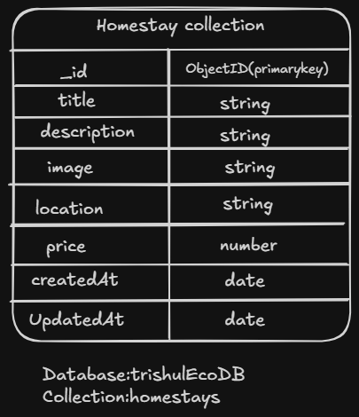

# Trishul Eco Homestays

## 📌 Project Overview

Trishul Eco Homestays is a full-stack web application developed to manage eco-friendly homestay bookings. The application allows users to view available homestays and performs complete CRUD (Create, Read, Update, Delete) operations using a MongoDB database.

## 🛠 Tech Stack

### Frontend
- React.js
- Vite
- Tailwind CSS
- Axios

### Backend
- Node.js
- Express.js

### Database
- MongoDB Atlas
- Mongoose

# Database Choice

This project uses **MongoDB Atlas** as the cloud database and **Mongoose** as the Object Data Modeling (ODM) library.

### Why MongoDB?

- Flexible NoSQL document database
- Easy integration with Node.js
- Cloud-hosted using MongoDB Atlas
- Fast CRUD operations
- Scalable and suitable for modern web applications

# Database Schema

# API Endpoints

| Method | Endpoint | Description |
|---------|----------|-------------|
| GET | /api/homestays | Get all homestays |
| GET | /api/homestays/:id | Get homestay by ID |
| POST | /api/homestays | Create new homestay |
| PUT | /api/homestays/:id | Update homestay |
| DELETE | /api/homestays/:id | Delete homestay |
| GET | /api/search?location=Araku | Search by location |

# Set Up the Database

## 1. Install Dependencies

npm install

## 2. Create `.env`

PORT=5000

MONGO_URI=your_mongodb_connection_string

## 4. Run Backend

npm run dev

Backend runs on:

http://localhost:5000

# Author

Rajasri Nallamilli